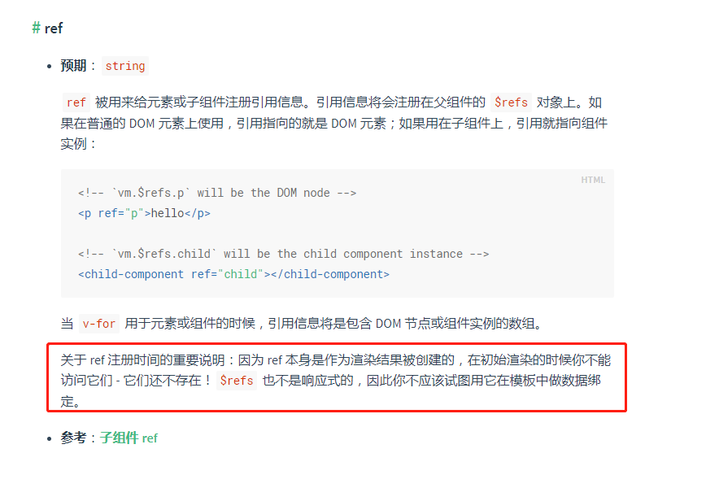

<!--
 * @Author: tim
 * @Date: 2020-05-20 14:09:59
 * @LastEditors: tim
 * @LastEditTime: 2020-05-20 14:17:20
 * @Description: https://www.jianshu.com/p/7dbdcd6dfad6
--> 

# Vue mounted中使用$refs出现undefined的解决方法

DOM结构已经渲染出来了，但是如果在DOM结构中的某个DOM节点使用了 **v-if** 、**v-show** 或者 **v-for**（即根据获得的后台数据来动态操作DOM，即响应式），那么这些DOM是不会再mounted阶段找到的。

所以如果在mounted钩子中使用$refs，如果ref是定位在有v-if、v-for、v-show中的DOM节点，这些判断下的DOM还没渲染，返回来的只能是undefined，因为在mounted阶段他们根本不存在！！！

如果说mounted阶段是加载阶段，那么updated阶段则是完成了数据更新到DOM的阶段(对加载回来的数据进行处理)，此时，ref、数据等等全部都挂载到DOM结构上去，在update阶段使用this.$refs.xxx，就100%能找到该DOM节点。

updated与mounted不同的是，在每一次的DOM结构更新，vue都会调用一次updated(){}钩子函数！而mounted仅仅渲染完成时只执行一次而已。

简单来说，只要在调试的时候，能看到元素的存在，在updated阶段都可以使用this.$refs.xxx找到对应的DOM节点！

