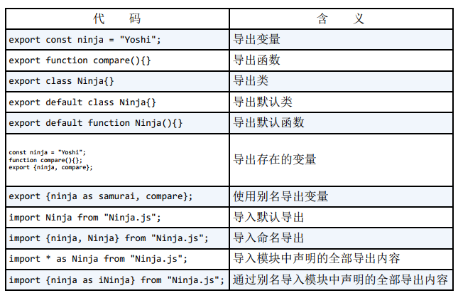

<!--
 * @Author: tim
 * @Date: 2020-10-28 17:23:12
 * @LastEditors: tim
 * @LastEditTime: 2020-10-29 10:34:24
 * @Description: 
-->
# 代码模块化 
> 定义模块接口， 通过接口可以调用模块的功能。
> 隐藏模块的内部实现， 使模块的使用者无需关注模块内部的实现细节。 同时， 隐藏模块的内部实现， 避免有可能产生的副作用和对bug的不必要修改

``` js
// 模块&模块扩展

const MouseCounterModule = function() { // ⇽--- 原始的MouseCounterModule
  let numClicks = 0;
  const handleClick = () => {
    alert(++numClicks);
  };
  return {
    countClicks: () => {
      document.addEventListener("click", handleClick);
    }
  };
}();

(function(module) { // ⇽--- 立即调用一个函数， 该函数接收需要扩展的模块作为参数
  let numScrolls = 0;
  const handleScroll = () => {
    alert(++numScrolls);
  } // ⇽--- 定义新的私有变量和函数
  
  module.countScrolls = () => {
    document.addEventListener("wheel", handleScroll);
  }; // ⇽--- 扩展模块接口
})(MouseCounterModule);   // ⇽--- 将模块传入作为参数
```

## AMD（Asynchronous Module Definition）和 CommonJS
> 除了语法和原理的区别之外，主要的区别是AMD的设计理念是明确基于浏览器，而CommonJS的设计是面向**通用JavaScript环境**（如Node.js服务端），而不局限于浏览器。 

### AMD 模块规范

AMD提供名为define的函数， 它接收以下参数：

* 新创建模块的ID。 使用该ID， 可以在系统的其他部分引用该模块。
* 当前模块依赖的模块ID列表。
* 初始化模块的工厂函数， 该工厂函数接收依赖的模块列表作为参数。

``` js
// AMD 定义模块
define('MouseCounterModule',['jQuery'], $ => { // ⇽--- 使用define函数指定模块及其依赖， 模块工厂函数会创建对应的模块
  let numClicks = 0;
  const handleClick = () => {
    alert(++numClicks);
  };
  
  return { // ⇽--- 模块的公共接口
    countClicks: () => {
      $(document).on("click", handleClick);
    }
  };
});
```

AMD有以下几项优点：

* 自动处理依赖， 我们无需考虑模块引入的顺序。
* 异步加载模块， 避免阻塞。
* 在同一个文件中可以定义多个模块。

### CommonJS 模块规范

* CommonJS 使用基于文件的模块， 所以每个文件中只能定义一个模块。
* CommonJS 提供变量module， 该变量具有属性exports， 通过exports可以很容易地扩展额外属性。 
* module.exports 作为模块的公共接口。

``` js
//MouseCounterModule.js
const $ = require("jQuery"); // ⇽--- 同步引入jQuery模块
let numClicks = 0;
const handleClick = () => {
  alert(++numClicks);
};

module.exports = { // ⇽--- 使用module.exports定义模块公共接口
  countClicks: () => {
    $(document).on("click", handleClick);
  }
};

// 在另一个文件中引用该模块，可以这样写：
const MouseCounterModule = require("MouseCounterModule.js");
MouseCounterModule.countClicks()
```

CommonJS 具有两个优势：

* 语法简单。 只需定义module.exports属性， 剩下的模块代码与标准JavaScript无差异。 引用模块的方法也很简单， 只需要使用require函数。
* CommonJS 是Node.js默认的模块格式， 所以我们可以使用npm上成千上万的包。

## ES6模块

* 与CommonJS类似， ES6模块语法相对简单， 并且基于文件（每个文件就是一个模块） 。
* 与AMD类似， ES6模块支持异步模块加载。

ES6 引入的两个关键字：

* export —— 从模块外部指定标识符。
* import —— 导入模块标识符。


ES6模块语法




