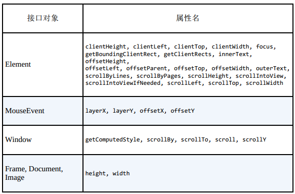

<!--
 * @Author: tim
 * @Date: 2020-10-29 14:21:29
 * @LastEditors: tim
 * @LastEditTime: 2020-10-29 14:30:49
 * @Description: 
-->
# DOM操作

## 避免布局抖动
> 批量DOM读取和写入以避免布局抖动

``` html
<div id="ninja">I’m a ninja</div>
<div id="samurai">I’m a samurai</div>
<div id="ronin">I’m a ronin</div>

<script>
  const ninja = document.getElementById("ninja");
  const samurai = document.getElementById("samurai");
  const ronin = document.getElementById("ronin");

  // 批量读取所有的布局属性
  const ninjaWidth = ninja.clientWidth;
  const samuraiWidth = samurai.clientWidth;
  const roninWidth = ronin.clientWidth;  

  // 批次写入所有的布局属性
  ninja.style.width = ninjaWidth/2 + "px";
  samurai.style.width = samuraiWidth/2 + "px";
  ronin.style.width = roninWidth/2 + "px"; 
</script>  
```

## 引起布局抖动的API和属性



