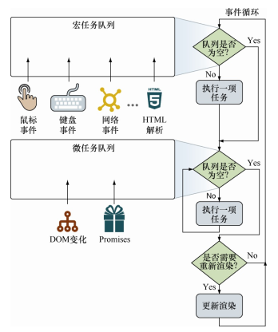
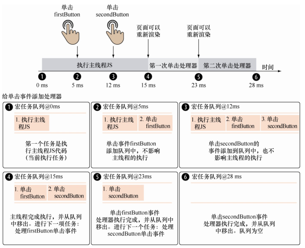
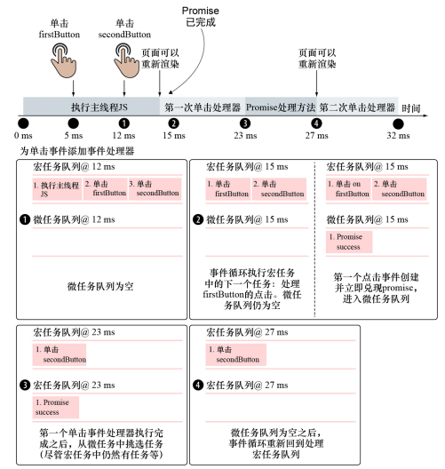
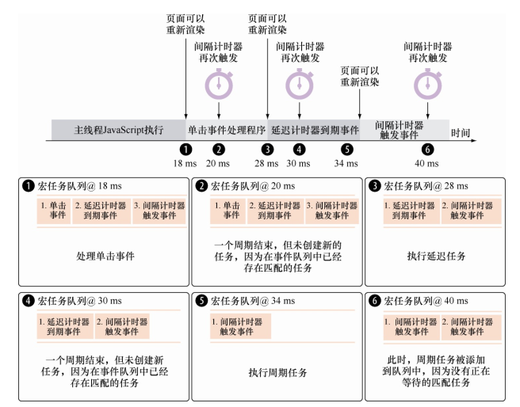

<!--
 * @Author: tim
 * @Date: 2020-10-29 15:10:39
 * @LastEditors: tim
 * @LastEditTime: 2020-10-30 09:55:04
 * @Description: 
-->
# 深入事件循环

事件循环基于两个基本原则：

* 一次处理一个任务。
* 一个任务开始后直到运行完成， 不会被其他任务中断。



## 单一任务队列示例

``` html
<!-- 主线程JavaScript代码执行时间需要15ms。
第一个单击事件处理器需要运行8ms。
第二个单击事件处理器需要运行5ms。 -->
<button id="firstButton"></button>
<button id="secondButton"></button>
<script>
const firstButton = document.getElementById("firstButton");
const secondButton = document.getElementById("secondButton");
firstButton.addEventListener("click", function firstHandler() {
/*Some click handle code that runs for 8 ms*/ // ⇽--- 在第一个按钮上注册点击事件处理器
});
secondButton.addEventListener("click", function secondHandler() {
/*Click handle code that runs for 5ms*/ // ⇽--- 在第二个按钮上注册另一个点击事件处理器
});
/*Code that runs for 15ms*/
</script>
```



## 同时含有宏任务和微任务示例

``` html
<!-- 第5ms单击firstButton。
第12ms单击secondButton。
firstButton的单击事件处理函数firstHandler需要执行8ms。
secondButton的单击事件处理函数secondHandler需要执行5ms -->
<button id="firstButton"></button>
<button id="secondButton"></button>
<script>
const firstButton = document.getElementById("firstButton");
const secondButton = document.getElementById("secondButton");
firstButton.addEventListener("click", function firstHandler(){
Promise.resolve().then(() => {
/*Some promise handling code that runs for 4 ms*/
}); ⇽--- 立即对象promise， 并且执行then方法中的回调函数
/*Some click handle code that runs for 8 ms*/
});
secondButton.addEventListener("click", function secondHandler(){
/*Click handle code that runs for 5ms*/
});
/*Code that runs for 15ms*/
</script>
```



##　玩转计时器： 延迟执行和间隔执行
> 计时器能延迟一段代码的运行， 延迟时长至少是指定的时长（单位是ms） 。 
> 我们将使用这种能力， 将长时间运行的任务分解为不阻塞事件循环的小任务， 以阻止浏览器渲染， 浏览器渲染过程会使得应用程序运行缓慢、 没有反应。

``` html
<button id="myButton"></button>

<script>
setTimeout(function timeoutHandler(){
/*Some timeout handle code that runs for 6ms*/
}, 10); // ⇽--- 注册10ms后延迟执行函数

setInterval(function intervalHandler(){
/*Some interval handle code that runs for 8ms*/
}, 10); // ⇽--- 注册每10ms执行的周期函数
const myButton = document.getElementById("myButton");
myButton.addEventListener("click", function clickHandler(){
/*Some click handle code that runs for 10ms*/
});  // ⇽--- 为按钮单击事件注册事件处理器
/*Code that runs for 18ms*/
</script>
```



setTimeout函数只到期一次， setInterval函数则不同， setInterval会持续执行直到被清除。 
因此， 在第20ms时， setInterval又一次触发。 但是， 此时间隔计时器的实例已经在队列中等待执行， 该触发被中止。 
**浏览器不会同时创建两个相同的间隔计时器**。

## 延迟执行与间隔执行的区别

``` js
setTimeout(function repeatMe(){
/* Some long block of code... */
}, 10); // ⇽--- 注册延迟任务

setInterval(() => {
/* Some long block of code... */
}, 10); // ⇽--- 注册周期任务， 每10ms执行一次任务
```

setTimeout内的代码在前一个回调函数执行完成之后， 至少延迟10ms执行（取决于事件队列的状态， 等待时间只会大于10ms）； 
而setInterval会尝试每10ms执行回调函数， 不关心前一个回调函数是否执行。间隔执行函数可以一个接一个地依次执行。

## 处理计算复杂度高的任务

``` js
const rowCount = 20000; // ⇽--- 初始化数据
const divideInto = 4;
const chunkSize = rowCount / divideInto;
let iteration = 0;
const table = document.getElementsByTagName("tbody")[0];

setTimeout(function generateRows() {
  const base = chunkSize * iteration; // ⇽--- 计算上一次离开的地方
  for (let i = 0; i < chunkSize; i++) {
    const tr = document.createElement("tr");
    for (let t = 0; t < 6; t++) {
      const td = document.createElement("td");
      td.appendChild(document.createTextNode((i + base) + "," + t +"," + iteration));
      tr.appendChild(td);
    } 
    table.appendChild(tr);
  }

  iteration++;

  if (iteration < divideInto) // ⇽--- 安排下一个阶段
    setTimeout(generateRows, 0);
}, 0); // ⇽--- 将超时延迟设置为0来表示下一次迭代应该“尽快”执行， 但仍然必须在UI更新之后执行
```

## 通过DOM代理事件
> DOM是元素的分层树， 发生在一个元素（target） 上的事件通常是通过DOM进行代理的， 有以下两种机制：
> 事件捕获模式： 事件从顶部元素向下传递到目标元素。
> 事件冒泡模式： 事件从目标元素向上冒泡到顶部元素。

``` js
const cells = document.querySelectorAll('td');
for (let n = 0; n < cells.length; n++) {
  cells[n].addEventListener('click', function(){
  this.style.backgroundColor = 'yellow';
  });
}

// 优雅的代理处理
const table = document.getElementById('someTable');
table.addEventListener('click', function(event){
if (event.target.tagName.toLowerCase() === 'td') // ⇽--- 当且仅当单击事件发生在cell元素上， 才执行动作（而不是随机的后代元素）
  event.target.style.backgroundColor = 'yellow';
});

```

## 自定义事件
> 通过内置的 CustomEvent 构造函数和 dispatchEvent 方法，创建和分发自定义事件，减少应用程序不同部分之间的耦合。

``` js
function triggerEvent(target, eventType, eventDetail) {
  const event = new CustomEvent(eventType, { // ⇽--- 使用 CustomEvent 构造器创建一个新事件
    detail: eventDetail // ⇽--- 通过 detail 属性为事件对象传入信息
  });
  target.dispatchEvent(event); // ⇽--- 使用内置的 dispatchEvent 方法向指定的元素派发事件
}

function performAjaxOperation() {
  triggerEvent(document, 'ajax-start', {url: 'my-url'});
   //⇽--- 使用延迟计时器模拟Ajax请求。 开始执行时， 触发ajax-start事件， 一段时间过去之后， 激活ajax-complete事件。 传入URL作为事件额外信息
  setTimeout(() => {
    triggerEvent(document, 'ajax-complete');
  }, 5000);
}

const button = document.getElementById('clickMe');
  button.addEventListener('click', () => {
  performAjaxOperation(); // ⇽--- 当单击一个按钮时， Ajax操作开始
});

document.addEventListener('ajax-start', e => { // ⇽--- 显示旋转图片， 处理 ajax-start 事件
  document.getElementById('whirlyThing').style.display = 'inline-block';
  assert(e.detail.url === 'my-url', 'We can pass in event data'); // ⇽--- 验证我们可以访问附加的事件数据
});

document.addEventListener('ajax-complete', e => { // ⇽--- 处理ajax-complete事件， 隐藏旋转图片
  document.getElementById('whirlyThing').style.display = 'none';
});
```


