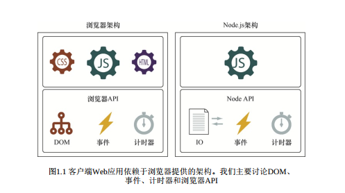

<!--
 * @Author: tim
 * @Date: 2020-10-19 16:56:14
 * @LastEditors: tim
 * @LastEditTime: 2020-10-20 14:20:17
 * @Description: 
-->
# 无处不在的javascript
> 对象、 原型、 函数和闭包的紧密结合组成了JavaScript
> 深入理解JavaScript的核心机制和浏览器所提供的架构。

## 聚焦特性
* 生成器， 一种可以基于一次请求生成多次值的函数， 在不同请求之间也能挂起执行。
* Promise， 让我们更好地控制异步代码。
* 代理， 让我们控制对特定对象的访问。
* 高级数组方法， 书写更优雅的数组处理函数。
* Map， 用于创建字典集合； Set， 处理仅包含不重复项目的集合。
* 正则表达式， 简化用代码书写起来很复杂的逻辑。
* 模块， 把代码划分为较小的可以自包含的片段， 使项目更易于管理。

## 浏览器架构

