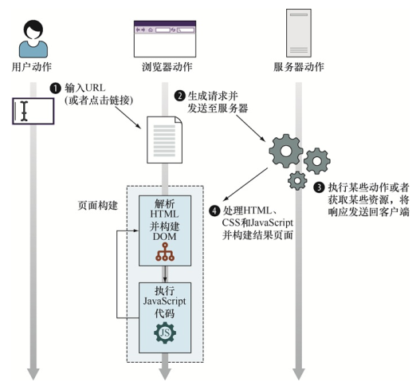

<!--
 * @Author: tim
 * @Date: 2020-10-19 16:56:14
 * @LastEditors: tim
 * @LastEditTime: 2020-10-20 14:21:57
 * @Description: 
-->
# 运行时的页面构建过程
* Web应用的生命周期步骤
* 从HTML代码到Web页面的处理过程
* JavaScript代码的执行顺序
* 与事件交互
* 事件循环

## 客户端Web应用的周期从用户指定某个网站地址（或单击某个链接） 开始，由两个步骤组成： `页面构建`和`事件处理`


* 页面构建阶段从浏览器接收页面代码开始。 其执行分为两个步骤：HTML解析和DOM(文档对象模型)构建， 以及JavaScript代码的执行



* 事件处理是异步的，下面是一个简单的流程图


事件处理示例


## 在客户端Web应用中， 有两种方式注册事件：

1. 通过把函数赋给某个特殊属性
``` js
# 只能注册一个事件处理器，容易被改写掉
document.body.onclick = function（） {};
```

2. 通过使用内置addEventListener方法
``` js
# 可以同时注册多个事件
document.body.addEventListener('click', () => console.log(111))
document.body.addEventListener('click', () => console.log(222))
```
