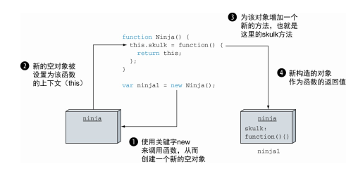

<!--
 * @Author: tim
 * @Date: 2020-10-21 14:12:43
 * @LastEditors: tim
 * @LastEditTime: 2020-10-23 09:57:42
 * @Description: 
-->
# 函数进阶：理解函数调用
* 函数中两个隐含的参数： `arguments` 和 `this`
* 调用函数的不同方式
* 处理函数上下文的问题

## 使用隐式函数参数
> 将arguments对象作为函数参数的别名使用时会影响代码的可读性，
> 因此在JavaScript提供的严格模式（strict mode） 中将无法再使用它。

## 函数调用
> 在JavaScript中， 将一个函数作为方法（method） 调用仅仅是函数调用的一种方式。 
> 事实上， this参数的指向不仅是由定义函数的方式和位置决定的， 同时还严重受到函数调用方式的影响。 

* 作为一个函数(function)——skulk()， 直接被调用。 

  函数上下文（this关键字的值） 有两种可能性： 在非严格模式下， 它将是全局上下文（window对象） ， 而在严格模式下， 它将是undefined。
  ``` js
  function ninja() {
    return this;
  } 

  function samurai() {
    "use strict";
    return this;
  }
  ```
  
* 作为一个方法(method)——ninja.skulk()， 关联在一个对象上， 实现面向对象编程
  
  当函数作为某个对象的方法被调用时， 该对象会成为函数的上下文， 并且在函数内部可以通过参数访问到。 这也是JavaScript实现面向对象编程的主要方式之一

* 作为一个构造函数(constructor)——new Ninja()， 实例化一个新的对象

  使用关键字new调用函数会触发以下几个动作:
  
  1. 创建一个新的空对象
  2. 该对象作为this参数传递给构造函数， 从而成为构造函数的函数上下文
  3. 新构造的对象作为new运算符的返回值（除了我们很快要提到的情况之外） 

  

  * *如果构造函数返回一个对象， 则该对象将作为整个表达式的值返回， 而传入构造函数的this将被丢弃。*
  * *如果构造函数返回的是非对象类型， 则忽略返回值， 返回新创建的对象。*

  ``` js
  var puppet = {
    rules: false
  }; 

  function Emperor() {
    this.rules = true;
    // return puppet;   // <---- 返回对象
  } 
  var emperor = new Emperor(); 
  ```

* 通过函数的apply或者call方法——skulk.apply(ninja)或者skulk.call(ninja)
  >  通常情况下， 事件回调函数的上下文是触发事件的对象

  ``` js   
  function Button(){ 
    this.clicked = false;
    this.click = function(){ 
      //⇽--- 单击事件处理器的声明函数。 由于该函数是对象的方法， 所以在函数中使用this来获取对象的引用
      // 在本例中是HTML中的按钮， 而非button对象  
      this.clicked = true;
    }
    // 箭头函数自身不含上下文， 从定义时的所在函数继承上下文。 箭头回调函数内的this指向按钮对象
    // 调用箭头函数时， 不会隐式传入this参数， 而是从定义时的函数继承上下文。 
    // 在本例中， 箭头函数在构造函数内部， this指向新创建的对象本身， 因此无论何时调用click函数，this都将指向新创建的button对象。
    this.click2 = () => {
      this.clicked = true;
    }
  }
  var button = new Button(); // ⇽--- 创建一个用于跟踪按钮是否被单击的实例
  var elem = document.getElementById("test");
  elem.addEventListener("click", button.click); // ⇽--- 在按钮上添加单击处理器  
  // elem.addEventListener("click", button.click.bind(button)); // ⇽--- 使用bind函数创建新函数， 绑定到button对象上
  elem.addEventListener("dbclick", button.click2); 
  ```

* **箭头函数没有单独的this值， this在箭头函数创建时确定**

* 所有函数均可使用bind方法， 创建新函数， 并绑定到bind方法传入的参数上。 被绑定的函数与原始函数具有一致的行为
