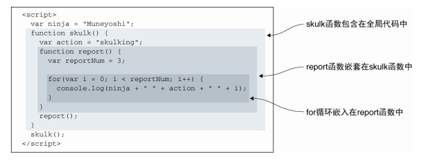
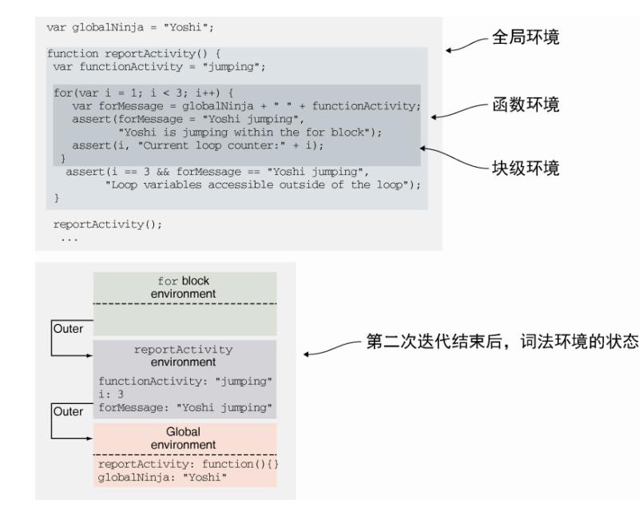
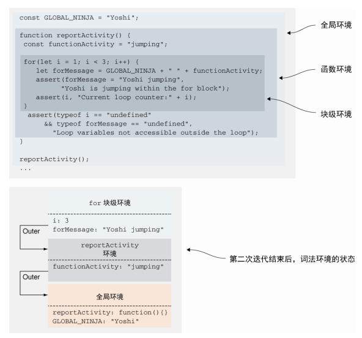
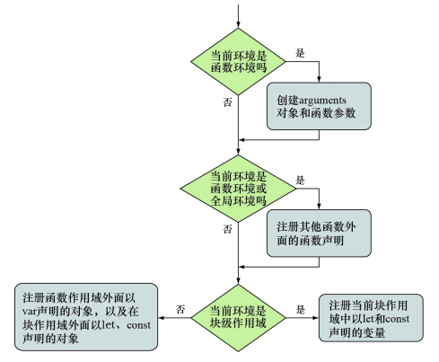
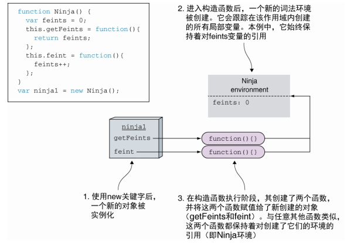
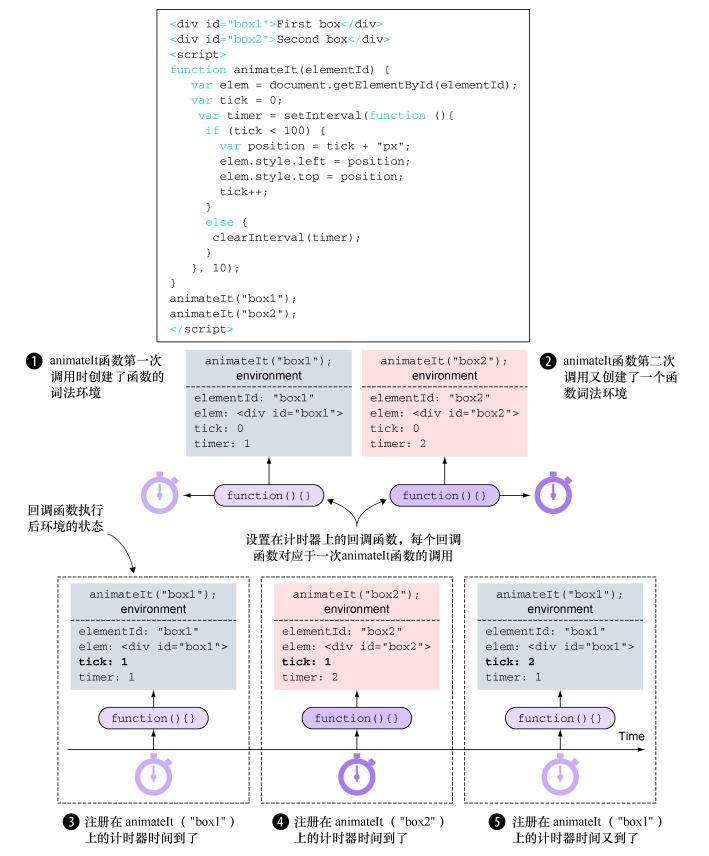

<!--
 * @Author: tim
 * @Date: 2020-10-21 16:55:19
 * @LastEditors: tim
 * @LastEditTime: 2020-10-22 17:56:10
 * @Description: 
-->
# 精通函数： 闭包和作用域
* 使用闭包简化代码
* 使用执行上下文跟踪JavaScript程序的执行
* 使用词法环境（Lexical Environment） 跟踪变量的作用域 [*词法环境是JavaScript作用域的内部实现机制， 人们通常称为作用域(scopes)*]
* 理解变量的类型
* 探讨闭包的工作原理


## 使用词法环境跟踪变量的作用域
> 词法环境（lexical environment） 是JavaScript引擎内部用来跟踪标识符与特定变量之间的映射关系。

通常来说， 词法环境与特定的JavaScript代码结构关联， 既可以是一个函数、 一段代码片段， 也可以是try-catch语句。  
这些代码结构（函数、 代码片段、 try-catch） 可以具有独立的标识符映射表。 



**内部代码结构可以访问外部代码结构中定义的变量** 


**无论何时调用函数， 都会创建一个新的执行环境， 被推入执行上下文栈。 此外， 还会创建一个与之相关联的词法环境。**

## 变量可变性

const变量只能在声明时被初始化一次， 之后再也不允许将全新的值赋值给const变量即可。  
但是， 我们仍然可以修改const变量已经存在的值，只是不能重写const变量。


## 定义变量的关键字与词法环境



* 变量globalNinja是在全局环境中定义的（距离最近的函数内或全局词法环境） 
* reportActivity函数创建的函数环境， 包含变量 functionActivity、 i与forMessage， 这3个变量均通过关键字var定义的， 与它们距离最近的是reportActivity函数 
* for循环的块级作用域， 关键字var定义的变量忽略块级作用域 

**通过var声明变量， 在距离最近的函数内或全局词法环境中定义（忽略块级作用域） 。**
**变量forMessage与i虽然是被包含在for循环中， 但实际是在reportActivity环境中注册的（距离最近的函数环境）。** 




**当使用let与const声明变量时， 变量是在距离最近的环境中定义的。 变量forMessage与i是在for循环的块级作用域中定义的**

## 在词法环境中注册标识符

变量提升(variable hoisting)：变量的声明提升至函数顶部， 函数的声明提升至全局代码顶部



``` js
assert(typeof fun === "function", "We access the function"); // ⇽--- fun指向一个函数
var fun = 3; // ⇽--- 定义变量fun并赋值为数字3
assert(typeof fun === "number", "Now we access the number"); // ⇽--- fun指向一个数字
function fun(){} ⇽--- 函数声明变量提升(variable hoisting)
assert(typeof fun === "number", "Still a number"); // ⇽--- fun 仍然指向数字
```

在构造器内定义的对象方法的闭包内实现私有变量



闭包和作用域



* 每次调用animateIt函数时， 均会创建新的词法环境❶❷， 该词法环境保存了动画所需的重要变量（elementId、 elem、 动画元素、 tick、 计
数次数、 timer、 动画计数器的ID） 。  
* 只要至少有一个通过闭包访问这些变量的函数存在， 这个环境就会一直保持。  
* 在本例中， 浏览器会一直保持setInterval的回调函数， 直到调用clearInterval方法。随后， 当一个计时器到期， 浏览器会调用对应的回调函数， 通过回调函数的闭包访问创建闭包时的变量。 

