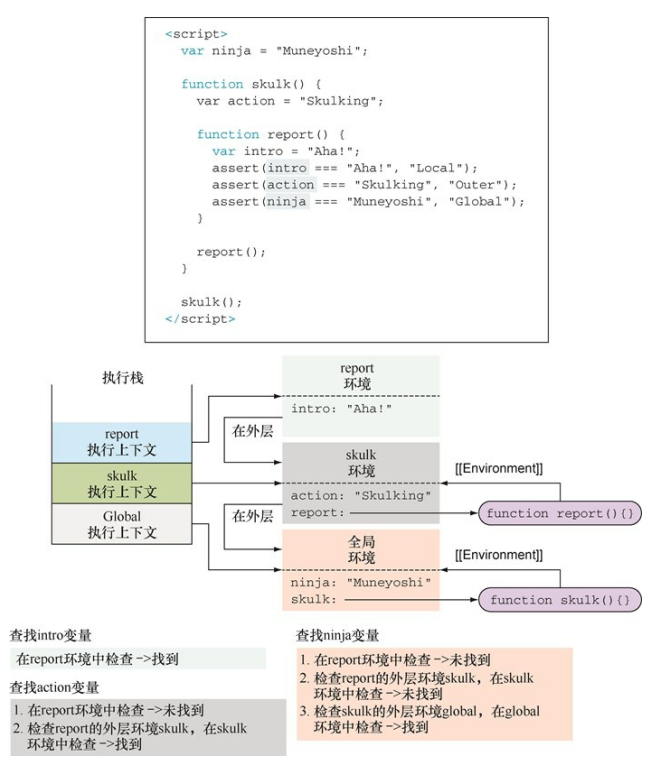

<!--
 * @Author: tim
 * @Date: 2020-10-21 16:55:19
 * @LastEditors: tim
 * @LastEditTime: 2020-11-06 13:46:46
 * @Description: 
-->
# 精通函数： 闭包和作用域
* 使用闭包简化代码
* 使用执行上下文跟踪JavaScript程序的执行
* 使用词法环境（Lexical Environment） 跟踪变量的作用域 [*词法环境是JavaScript作用域的内部实现机制， 人们通常称为作用域(scopes)*]
* 理解变量的类型
* 探讨闭包的工作原理

## 区分 LHS 和 RHS 
> **严格模式禁止自动或隐式地创建全局变量**
> ReferenceError 同作用域判别失败相关， 而 TypeError 则代表作用域判别成功了， 但是对结果的操作是非法或不合理的。

* RHS 查询在所有嵌套的作用域中遍寻不到所需的变量，引擎就会抛出  `ReferenceError` 异常。
* 如果 RHS 查询找到了一个变量， 但是你尝试对这个变量的值进行不合理的操作，比如试图对一个非函数类型的值进行函数调用， 或着引用 null 或 undefined 类型的值中的属性， 那么引擎会抛出另外一种类型的异常， 叫作 `TypeError`。
* 非“严格模式” 下，LHS 查询时， 如果在顶层（全局作用域） 中也无法找到目标变量，全局作用域中就会创建一个具有该名称的变量。
* 严格模式中 LHS 查询失败时， 并不会创建并返回一个全局变量， 引擎会抛出同 RHS 查询失败时类似的 `ReferenceError` 异常。

## 通过执行上下文来跟踪代码
> JavaScript引擎执行代码时， 每一条语句都处于特定的执行上下文中。JavaScript代码有两种类型： 
> 一种是全局代码， 在所有函数外部定义； 
> 一种是函数代码， 位于函数内部。 

两种类型的代码， 那么就有两种执行上下文：
全局执行上下文：全局执行上下文只有一个， 当JavaScript程序开始执行时就已经创建了全局上下文； 
函数执行上下文：函数执行上下文是在每次调用函数时， 就会创建一个新的。

JavaScript基于单线程的执行模型： 

在某个特定的时刻只能执行特定的代码。一旦发生函数调用， 当前的执行上下文必须停止执行， 并创建新的函数执行上下文来执行函数。 当函数执行完成后， 将函数执行上下文销毁， 并重新回到发生调用时的执行上下文中。所以需要跟踪执行上下文——正在执行的上下文以及正在等待的上下文。 最简单的跟踪方法是使用执行上下文栈（或称为调用栈） 。

## 使用词法环境跟踪变量的作用域
> 词法环境（lexical environment） 是JavaScript引擎内部用来跟踪标识符与特定变量之间的映射关系。

通常来说， 词法环境与特定的JavaScript代码结构关联， 既可以是一个函数、 一段代码片段， 也可以是try-catch语句。  
这些代码结构（函数、 代码片段、 try-catch） 可以具有独立的标识符映射表。 


**内部代码结构可以访问外部代码结构中定义的变量** 



**无论何时调用函数， 都会创建一个新的执行环境， 被推入执行上下文栈。 此外， 还会创建一个与之相关联的词法环境。**

## 变量可变性

const变量只能在声明时被初始化一次， 之后再也不允许将全新的值赋值给const变量即可。  
但是， 我们仍然可以修改const变量已经存在的值，只是不能重写const变量。


## 定义变量的关键字与词法环境


* 变量globalNinja是在全局环境中定义的（距离最近的函数内或全局词法环境） 
* reportActivity函数创建的函数环境， 包含变量 functionActivity、 i与forMessage， 这3个变量均通过关键字var定义的， 与它们距离最近的是reportActivity函数 
* for循环的块级作用域， 关键字var定义的变量忽略块级作用域 

**通过var声明变量， 在距离最近的函数内或全局词法环境中定义（忽略块级作用域） 。**
**变量forMessage与i虽然是被包含在for循环中， 但实际是在reportActivity环境中注册的（距离最近的函数环境）。** 


**当使用let与const声明变量时， 变量是在距离最近的环境中定义的。 变量forMessage与i是在for循环的块级作用域中定义的**

## 在词法环境中注册标识符

变量提升(variable hoisting)：变量的声明提升至函数顶部， 函数的声明提升至全局代码顶部


``` js
assert(typeof fun === "function", "We access the function"); // ⇽--- fun指向一个函数
var fun = 3; // ⇽--- 定义变量fun并赋值为数字3
assert(typeof fun === "number", "Now we access the number"); // ⇽--- fun指向一个数字
function fun(){} ⇽--- 函数声明变量提升(variable hoisting)
assert(typeof fun === "number", "Still a number"); // ⇽--- fun 仍然指向数字
```

在构造器内定义的对象方法的闭包内实现私有变量


闭包和作用域


* 每次调用animateIt函数时， 均会创建新的词法环境❶❷， 该词法环境保存了动画所需的重要变量（elementId、 elem、 动画元素、 tick、 计
数次数、 timer、 动画计数器的ID） 。  
* 只要至少有一个通过闭包访问这些变量的函数存在， 这个环境就会一直保持。  
* 在本例中， 浏览器会一直保持setInterval的回调函数， 直到调用clearInterval方法。随后， 当一个计时器到期， 浏览器会调用对应的回调函数， 通过回调函数的闭包访问创建闭包时的变量。 

