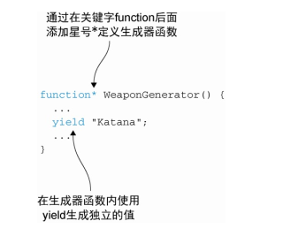
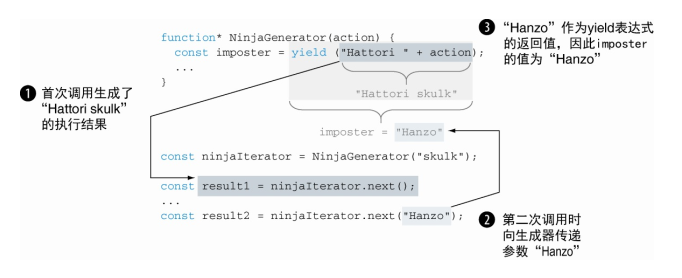
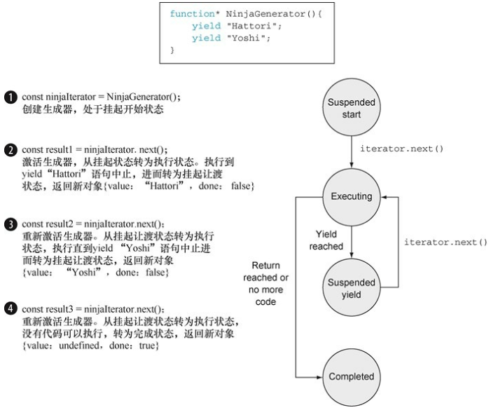
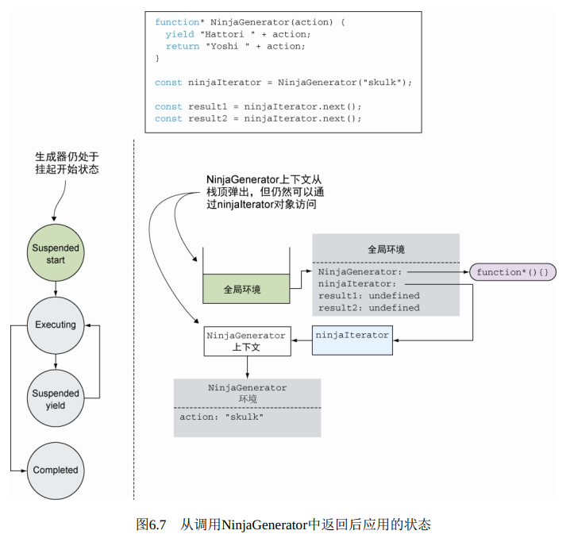
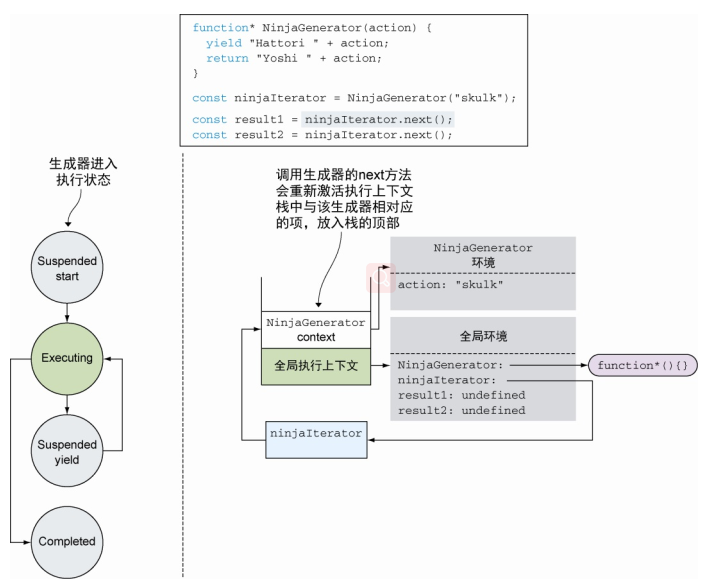
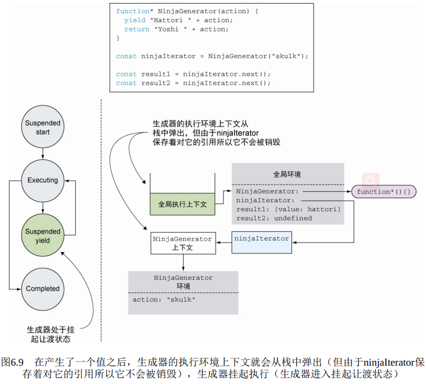

<!--
 * @Author: tim
 * @Date: 2020-10-23 09:52:09
 * @LastEditors: tim
 * @LastEditTime: 2020-10-23 17:17:09
 * @Description: 
-->
# 未来的函数：生成器和promise

* 通过生成器让函数持续执行
* 使用promise处理异步任务
* 使用生成器和promise书写优雅代码

> 生成器（generator） 函数能生成一组值的序列， 但每个值的生成是基于每次请求， 并不同于标准函数那样立即生成。我们必须显式地向生成器请求一个新的值， 随后生成器要么响应一个新生成的值， 要么就告诉我们它之后都不会再生成新值。更让人好奇的是， 每当生成器函数生成了一个值， 它都不会像普通函数一样停止执行。相反， 生成器几乎从不挂起。 随后， 当对另一个值的请求到来后， 生成器就会从上次离开的位置恢复执行。 

## 生成器函数



``` js
function* WeaponGenerator() { 
  yield "Katana";
  yield "Wakizashi";
  yield "Kusarigama";
} 
for (let weapon of WeaponGenerator()) {
	console.log(weapon)
}

// iterator 迭代器
var res = WeaponGenerator();

// 调用迭代器的next方法向生成器请求一个新值
res.next()  // {value: "Wakizashi", done: false}

// 使用while循环迭代生成器结
var item;
while ( !(item=g.next()).done ) {
	console.log(item)
}

// 把执行权交给下一个生成器
function* WarriorGenerator(){
    yield "Sun Tzu";
    yield* NinjaGenerator(); 
    yield "Genghis Khan";
} 

function* NinjaGenerator(){
    yield "Hattori";
    yield "Yoshi";
}
```

## 使用生成器

``` js
// 使用生成器生成ID序列
function* IdGenerator() { // ⇽--- 定义生成器函数IdGenerator
    let id = 0; // ⇽--- 一个始终记录ID的变量， 这个变量无法在生成器外部改变
    while (true) {
    	yield ++id;
	} // ⇽--- 循环生成无限长度的ID序列
} 
const idIterator = IdGenerator(); //⇽--- 这个迭代器我们能够向生成器请求新的ID值

let id = idIterator.next().value; 
```

``` html
<div id="subTree">
  <form>
    <input type="text">
  </form>
  <p>Paragraph</p>
  <span>Span</span>
</div>
```

``` js
// 用生成器遍历DOM树
function* DomTraversal(element){
  console.log('start-')
  yield element;        // 遇到 yield，响应生成值dlement后，程序挂起，等待下一个next
  console.log('next-')  // 
  element = element.firstElementChild;
  while (element) {
    yield* DomTraversal(element); // ⇽--- 用yield将迭代控制转移到另一个Dom Traversal生成器实例上
    element = element.nextElementSibling;
  }
} 
const subTree = document.getElementById("subTree");
for(let element of DomTraversal(subTree)) {
  console.log(element !== null, element.nodeName);
} // ⇽--- 使用for-of对节点进行循环迭代
```

## 与生成器交互
> 向生成器发送值， 从而实现双向通信！ 使用生成器能够生成中间结果， 在生成器以外也能够使用该结果进行任何操作

``` js
function* NinjaGenerator(action) { // ⇽--- 生成器可以像其他函数一样接收标准参数
  const imposter = yield ("Hattori " + action); // ⇽--- 挂起的表达式。 产生一个值的同时， 生成器会返回一个中间计算结果。 通过带有参数的调用迭代器的next方法， 我们可以将数据传递回生成器
  assert(imposter === "Hanzo", "The generator has been infiltrated");
  yield ("Yoshi (" + imposter + ") " + action); // ⇽--- 传递回的值将成为yield表达式的返回值， 因此impostrer的值是Hanzo
} 

const ninjaIterator = NinjaGenerator("skulk"); // ⇽--- 普通的参数传递
const result1 = ninjaIterator.next();
assert(result1.value === "Hattori skulk","Hattori is skulking"); // ⇽---触发生成器的执行， 并检测返回值是否正确
const result2 = ninjaIterator.next("Hanzo");  // 通过next方法传入参数
assert(result2.value === "Yoshi (Hanzo) skulk","We have an imposter!"); //⇽--- 将数据作为next方法的参数传递给生成器， 并检测返回值是否符合预期
```

**使用next方法向生成器发送值**



分析：这个例子中我们调用了两次ninjaIterator的next方法。 第一次调用ninjaIterator.next(), 请求了生成器的第一个值。 由于生成器还没开始执行， 这次调用则启动了生成器， 对表达式"Hattori " + action进行求值，得到了值"Hattori skulk"， 并将该生成器的执行挂起。第二次调用ninjaIterator的next方法则发生了有趣的事：ninjaIterator.next ("Hanzo")。 这一次， 我们使用next方法将计算得到的值又传递回生成器。 在生成器当前挂起的表达式 **yield ("Hattori "+ action)** 位置挂起， 故而值Hanzo作为参数传入了next()方法， 并用作整个yield表达式的值。 本例中， 也就是表示语句imposter = yield ("Hattori "+ action) 中的变量imposter最终值为Hanzo。

## 执行过程

* 挂起开始——创建了一个生成器后， 它最先以这种状态开始。 其中的任何代码都未执行。
* 执行——生成器中的代码执行的状态。 执行要么是刚开始， 要么是从上次挂起的时候继续的。 当生成器对应的迭代器调用了next方法， 并且当前存在可执行的代码时， 生成器都会转移到这个状态。
* 挂起让渡——当生成器在执行过程中遇到了一个yield表达式， 它会创建一个包含着返回值的新对象， 随后再挂起执行。 生成器在这个状态暂停并等待继续执行。
* 完成——在生成器执行期间， 如果代码执行到return语句或者全部代码执行完毕， 生成器就进入该状态。



``` js
// 生成的重用
function* NinjaGenerator(action) {
  yield "Hattori " + action;
  return "Yoshi " + action;
}
var ninjaIterator = NinjaGenerator("skulk");
ninjaIterator.next(); // Hattori skulk
ninjaIterator.next(); // Yoshi skulk
```

**通过执行上下文跟踪生成器函数**

一般情况下， 当程序从一个标准函数返回后， 对应的执行环境上下文会从栈中弹出， 并被完整地销毁。  
但由于ninjaIterator还保存着对它的引用， 所以它不会被销毁。 你可以把它看作一种类似闭包的事物。  








