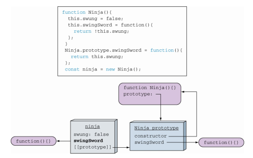
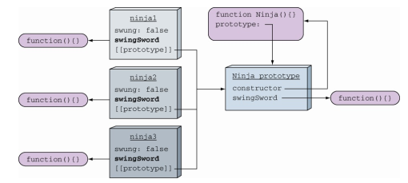
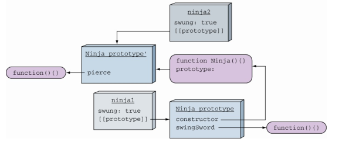
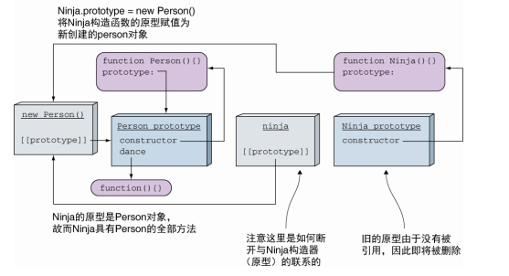
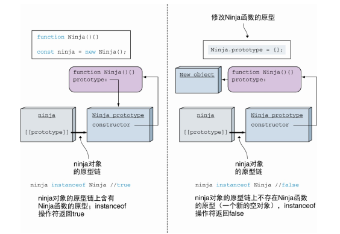

<!--
 * @Author: tim
 * @Date: 2020-10-27 09:51:25
 * @LastEditors: tim
 * @LastEditTime: 2020-10-27 17:29:27
 * @Description: 
-->
# 面向对象与原型

## 实例属性初始化过程的优先级
> 当把函数作为构造函数， 通过操作符new进行调用时， 它的上下文被定义为新的对象实例。 
> 通过原型暴露属性， 通过构造函数的参数进行初始化。

``` js
function Ninja(){
  this.swung = false; // ⇽--- 创建布尔类型的实例变量， 并初始化该变量的默认值为false
  this.swingSword = function(){
    return !this.swung; // ⇽--- 创建实例方法， 该方法的返回值为实例变量swung取反
  };
}
Ninja.prototype.swingSword = function(){
  return this.swung;
}; // ⇽--- 定义一个与实例方法同名的原型方法， 将会优先使用哪一个呢
const ninja = new Ninja();
assert(ninja.swingSword(), "Called the instance method, not the prototype method."); // ⇽---创建Ninja的一个实例， 并验证实例方法会重写与之同名的原型方法
```

**↓↓如果实例中可以查找到的属性， 将不会查找原型** 

 

在构造函数内部， 关键字this指向新创建的对象， 所以在构造器内添加的属性直接在新的ninja实例上。 

然后， 当通过ninja访问SwingSword属性时， 就不需要遍历原型链就可以立即找到并返回了在构造器内创建的属性。

**副作用：** 

每一个实例都会在构造器内创建自己的属性，如果创建大量的对象时会创建大量重复的方法，消耗了更多内存。 

 

## 原型与创建对象的关系
> 对象与函数原型之间的引用关系是在对象创建时建立的。 
> 新创建的对象将引用新的原型，原来旧的对象保持着原有的原型。

``` js
function Ninja() {
  this.swung = true;
}

// ninja1 实例
const ninja1 = new Ninja();

// 增加原型方法 swingSword
// 因为 ninja1 实例指向 Ninja 原型， 在实例构造完成之后对原型做更改，该实例仍然能够访问
Ninja.prototype.swingSword = function() {
  return this.swung;
}

// 原型替换，已经构建的实例保持引用旧的原型
// Ninja 函数不再指向旧的 Ninja 原型， 但是旧的原型仍然存在于 ninja1 的实例中，通过原型链仍然能够访问swingSword方法
Ninja.prototype = {
  pierce: function() {
    return true;
  }
}
```



## 继承的实现
> 创建原型继承的最佳技术方案是一个对象的原型直接是另一个对象的实例：
> SubClass.prototype = new SuperClass();

``` js
function Person(){}
Person.prototype.dance = function(){};

function Ninja(){}
// 通过将Ninja的原型赋值为 Person 的实例，实现 Ninja 继承 Person
Ninja.prototype = new Person(); 

// 解决 constructor 属性被覆盖的问题
Object.defineProperties(Ninja.prototype, 'constructor', {
  enumerable: false,
  value: Ninja,
  writable: true
});

var ninja = new Ninja();

// 首先查找Ninja对象本身，由于 Ninja 对象本身不具有 dance 方法， 接下来搜索 Ninja 对象的原型即 Person 对象。 
// Person对象也不具有dance方法， 所以再接着查找Person对象的原型， 最终找到了dance方法。 
ninja.dance();
```



## instanceof 操作符
> 检查右边的函数**原型**是否存在于操作符左边的对象的原型链上。 
> 小心函数的原型可以随时发生改变

``` js
function Ninja(){}

const ninja = new Ninja();
assert(ninja instanceof Ninja, "Our ninja is a Ninja!");

// 修改 Ninja 的原型，指向新的对象
Ninja.prototype = {};
// 虽然 ninja 仍然是由 Ninja 构造器创建的， 但是instanceof操作符结果显示 ninja 不是 Ninja 的实例
assert(!(ninja instanceof Ninja), "The ninja is now not a Ninja!?");
```



## ES6的class
> class只是语法糖，使得在JavaScript模拟类的代码更为简洁，但是底层仍然是基于原型的实现。
> 继承类使用 extends 关键字。

``` js
class Person {
  constructor(name){
    this.name = name;
  } 
  dance(){
    return true;
  }
} 

// 使用关键字extends实现继承
class Ninja extends Person {
  constructor(name, weapon){
    super(name); // 使用关键字super调用基类构造函数
    this.weapon = weapon;
  }
}
```