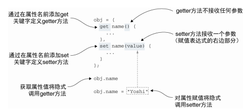

<!--
 * @Author: tim
 * @Date: 2020-10-28 09:23:03
 * @LastEditors: tim
 * @LastEditTime: 2020-10-28 10:46:51
 * @Description: 
-->
# 控制对象的访问

* 使用getter和setter控制访问对象的属性  

* 通过代理控制对象的访问

* 使用代理解决交叉访问的问题

## 定义 getter 和 setter

### 在对象字面量中定义



``` js
var obj = {
  list: [1, 2, 3],
  get first() {
    console.log('get');
    return this.list[0];
  },
  set first(value) {
    console.log('set');
    this.list[0] = value;
  }
}

obj.first;   // get 
obj.first = 11; // set 
```

### 在ES6的class中使用

``` js
class Obj {
  constructor() {
    this.list = [1, 2, 3];
  }

  get first() {
    console.log('get');
    return this.list[0];
  }
  
  set first(value) {
    console.log('set');
    this.list[0] = value;
  }
}

var obj = new Obj();
obj.first;
obj.first = 11;
``` 

### 通过Object.defineProperty定义

``` js
var obj = {
  list: [1, 2, 3]
};
Object.defineProperty(obj, 'first', {
  get() {
    console.log('get');
    return obj.list[0];
  },
  set(value) {
    console.log('set');
    obj.list[0] = value;
  },
});
```

## 使用代理记录日志

``` js
function makeLoggable(target) { // 定义形参为target的函数， 并使得target可以记录日志
  return new Proxy(target, { // 针对target对象创建代理
    get: (target, property) => {
      report("Reading " + property);  // 通过get方法实现属性读取时记录日志
      return target[property];
    }, 

    set: (target, property, value) => {
      report("Writing value " + value + " to " + property); // 通过set方法实现属性赋值时记录日志
      target[property] = value; 
    }
  });
} 

let ninja = { name: "Yoshi"};
ninja = makeLoggable(ninja); // 创建新的ninja对象， 并作为目标对象传入makeLoggable方法， 使其可以记录日志
assert(ninja.name === "Yoshi", "Our ninja Yoshi");
ninja.weapon = "sword"; // 对代理对象进行读写操作时， 均会通过代理方法记录日志
```

##　使用代理实现数组负索引
> 通过代理添加了一个间接层， 使我们能够实现所有这些很酷的特性， 但与此同时它引入了大量的额外的处理， 会影响性能

``` js
const ninjas = ["Yoshi", "Kuma", "Hattori"];
ninjas[0]; //"Yoshi"
ninjas[1]; //"Kuma"
ninjas[2]; //"Hattori" ⇽--- 访问数组元素的标准方法， 使用正索引
// ninjas[-1]; //"Hattori"
// ninjas[-2]; //"Kuma"
// ninjas[-3]; //"Yoshi" ⇽--- 使用负索引可以逆向访问数组元素， 如为-1， 则返回最后一项数组元素

function createNegativeArrayProxy(array) {
  if (!Array.isArray(array)) {
    throw new TypeError('Expected an array'); // 如果传入的参数不是数组， 则抛出异常
  }
  return new Proxy(array, { // 返回新的代理。 该代理使用传入的数组作为代理目标
    get: (target, index) => { // 当读取数组元素时调用get方法
      index = +index; // 使用一元+操作符将属性名变成的数值
      return target[index < 0 ? target.length + index : index]; // 如果访问的是负向索引， 则逆向访问数组。 如果访问的是正向索引， 则正常访问数组
    },
    set: (target, index, val) => { // 当写入数组元素时， 调用set方法
      index = +index;
      return target[index < 0 ? target.length + index : index] = val;
    }
  });
}
```

## 检查代理的性能限制

``` js
function measure(items){
  // 在执行循环体之前获取当前时间
  const startTime = new Date().getTime(); 
  // 在一个长时间运行的循环中访问集合中的元素
  for(let i = 0; i < 500000; i++){
    items[0] === "Yoshi";
    items[1] === "Kuma";
    items[2] === "Hattori";
  }
  return new Date().getTime() - startTime; // 测量循环体的执行时间
} 

const ninjas = ["Yoshi", "Kuma", "Hattori"];
const proxiedNinjas = createNegativeArrayProxy(ninjas); // 比较标准 数组访问和通过代理访问的执行时间差异

// 在Chrome浏览器， 代理数组的执行时间大约为正常数组的30倍
console.log("Proxies are around", Math.round(measure(proxiedNinjas)/measure(ninjas))); // 创建标准数组和代理数组
```


