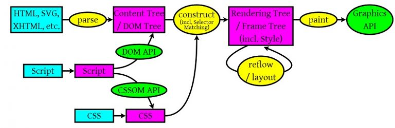

<!--
 * @Author: tim
 * @Date: 2020-10-14 16:41:43
 * @LastEditors: tim
 * @LastEditTime: 2020-11-16 13:48:47
 * @Description: https://coolshell.cn/articles/9666.html
-->
# 浏览器的渲染原理简介

## 浏览器工作大流程

从上面这个图中，我们可以看到那么几个事：

1. 浏览器会解析三个东西：

一个是HTML/SVG/XHTML，事实上，Webkit有三个C++的类对应这三类文档。解析这三种文件会产生一个DOM Tree。
CSS，解析CSS会产生CSS规则树。
Javascript，脚本，主要是通过DOM API和CSSOM API来操作DOM Tree和CSS Rule Tree.

2. 解析完成后，浏览器引擎会通过DOM Tree 和 CSS Rule Tree 来构造 Rendering Tree。注意：

Rendering Tree 渲染树并不等同于DOM树，因为一些像Header或display:none的东西就没必要放在渲染树中了。
CSS 的 Rule Tree主要是为了完成匹配并把CSS Rule附加上Rendering Tree上的每个Element。也就是DOM结点。也就是所谓的Frame。
然后，计算每个Frame（也就是每个Element）的位置，这又叫layout和reflow过程。

3. 最后通过调用操作系统Native GUI的API绘制。

## DOM解析

## CSS解析

## 渲染

* Reflow 回流：因为元素的规模尺寸，布局，隐藏等改变而需要重新构建，回流必将引起重绘，而重绘不一定会引起回流。
1. Initial。网页初始化的时候。
2. Incremental。一些Javascript在操作DOM Tree时。
3. Resize。其些元件的尺寸变了。
4. StyleChange。如果CSS的属性发生变化了。
5. Dirty。几个Incremental的reflow发生在同一个frame的子树上。

* Repaint 重绘：更新属性只是影响元素的外观，风格，而不会影响布局

  屏幕的一部分要重画，比如某个CSS的背景色变了

## 减少reflow/repaint

* 尽可能少用 table 布局
* DOM 离线后再修改: 如先 隐藏或clone或使用documentFragment 对象在内存里操作DOM 
* 不要一条一条地修改DOM的样式。可以预先定义好css的class，然后修改DOM的className
* 尽可能的修改层级比较低的DOM
* 为动画的HTML元件使用fixed或absoult的position

流程：
1. 解析HTML(HTML Parser)
2. 构建DOM树(DOM Tree)
3. 渲染树构建(Render Tree)
4. 绘制渲染树(Painting)

## 浏览器从 DOM 元素到最终动画的展示

* 浏览器解析 HTML 获取 DOM 后分割为多个图层(GraphicsLayer)
* 对每个图层的节点计算样式结果（Recalculate style--样式重计算）
* 为每个节点生成图形和位置（Layout--回流和重布局）
* 将每个节点绘制填充到图层位图中（Paint Setup和Paint--重绘）
* 图层作为*纹理*(texture)上传至 GPU
* 符合多个图层到页面上生成最终屏幕图像（Composite Layers--图层重组）
* Web 动画很大一部分开销在于层的重绘，以层为基础的复合模型对渲染性能有着深远的影响。当不需要绘制时，复合操作的开销可以忽略不计，因此在试着调试渲染性能问题时，首要目标就是要避免层的重绘。那么这就给动画的性能优化提供了方向，减少元素的重绘与回流。

**什么是纹理(texture)？**
> 这里的纹理指的是 GPU 的一个术语：可以把它想象成一个从主存储器(例如 RAM)移动到图像存储器(例如 GPU 中的 VRAM)的位图图像(bitmap image)。一旦它被移动到 GPU 中，你可以将它匹配成一个网格几何体(mesh geometry)，在 Chrome 中使用纹理来从 GPU 上获得大块的页面内容。通过将纹理应用到一个非常简单的矩形网格就能很容易匹配不同的位置(position)和变形(transformation)，这也就是 3D CSS 的工作原理。